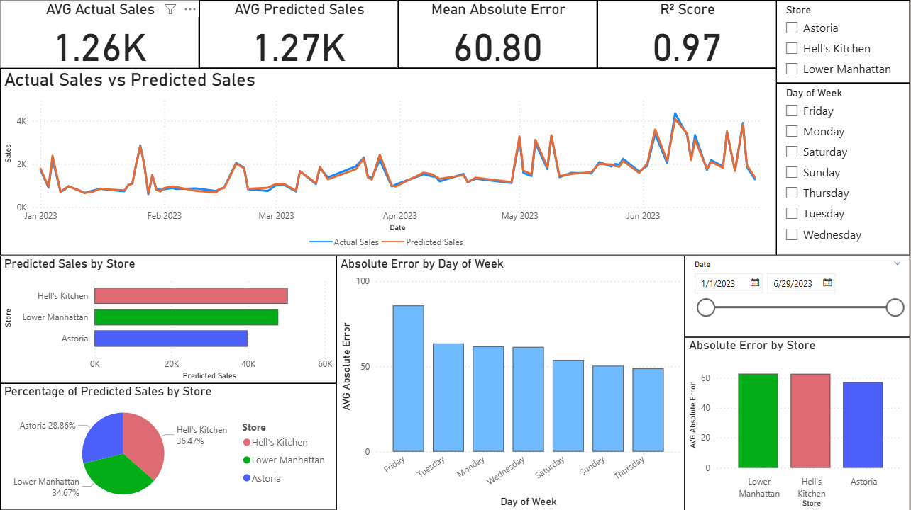

# Coffee Sales Prediction Model – Walkthrough & Thought Process

## Usage Guide

To try the model for yourself, follow the step-by-step instructions here:  
[How to Use the Model](coffee_sales_prediction_model/usage_guide.md)

## 1. Objective

The goal of this project is to develop a predictive model that forecasts daily sales for Maven Roasters (a fictional coffee shop with three NYC locations) using historical transaction data. The project showcases data analytics skills across SQL, Python, and Power BI.

## 2. Dataset

I explored Kaggle to find a dataset suitable for building a predictive model. I selected this dataset published by Ahmed Abbas: [dataset](https://www.kaggle.com/datasets/ahmedabbas757/coffee-sales/data). The original dataset included the following columns:

* **File**: `original_coffee_shop_sales.csv`
* **Columns**:

  * `transaction_id`: Unique sequential ID representing an individual transaction
  * `transaction_date`: Date of the transaction (MM/DD/YY)
  * `transaction_time`: Timestamp of the transaction (HH:MM:SS)
  * `transaction_qty`: Quantity of items sold
  * `store_id`: Unique ID of the coffee shop where the transaction took place
  * `store_location` : Location of the coffee shop where the transaction took place
  * `product_id` : Unique ID of the product sold
  * `unit_price` : Retail price of the product sold
  * `product_category` : Description of the product category
  * `product_type` : Description of the product type
  * `product_detail` : Description of the product detail

## 3. Data Cleaning & Transformation (SQL)

Before building the predictive model, I cleaned and transformed the data using SQL. I checked for missing values, duplicates, ensured consistency in spelling, and created or removed columns to better support the model. Below are some of the actual queries used:

```sql
SELECT 
  transaction_date AS date,
  store_id,
  store_location,
  ROUND(SUM(transaction_qty * unit_price),2) AS total_sales,
  COUNT(transaction_id) AS num_transactions,
  SUM(transaction_qty) AS total_items_sold  
FROM 
`premium-arc-461219-a7.coffee_shop.sales`
GROUP BY 
  date, store_id, store_location
ORDER BY 
  date, store_id
```

This query removed unnecessary columns for modeling and generated new columns that made the data easier to work with. However, I still needed a column to show the day of the week. Using the previous query as a subquery, I wrote the following query:

```sql
SELECT 
  date,
  store_id,
  store_location,
  total_sales,
  num_transactions,
  total_items_sold,
  FORMAT_DATE('%A', date) AS day_of_week
FROM 
(
  SELECT 
    transaction_date AS date,
    store_id,
    store_location,
    ROUND(SUM(transaction_qty * unit_price),2) AS total_sales,
    COUNT(transaction_id) AS num_transactions,
    SUM(transaction_qty) AS total_items_sold  
  FROM 
    `premium-arc-461219-a7.coffee_shop.sales`
  GROUP BY 
    date, store_id, store_location
  ORDER BY 
    date, store_id
)
```

This final query produced the data used to train the model. I saved and exported it as `clean_coffee_shop_sales.csv`, which includes:

* **File**: `clean_coffee_shop_sales.csv`
* **Columns**:

  * `date`: Date of sales (MM/DD/YY)
  * `store_id`: Unique ID of the coffee shop
  * `store_location`: Location of the coffee shop
  * `total_sales`: Total sales in dollars
  * `num_transactions`: Number of transactions on that date
  * `total_items_sold` : Number of items sold
  * `day_of_week` : Day of the week
    
## 4. Predictive Model (Python)

To forecast daily coffee sales, I built a linear regression model in Python (`model_training.py`) following a structured machine learning pipeline.

---
### A) Data Preparation & Feature Encoding
---

Loaded the cleaned dataset `clean_coffee_shop_sales.csv`:

```python
data_path = os.path.join("..", "data", "clean_coffee_shop_sales.csv")
df = pd.read_csv(data_path)
```

Converted the `date` column to datetime format for proper alignment and tracking:

```python
df['date'] = pd.to_datetime(df['date'])
```

Applied one-hot encoding to the categorical features `store_location` and `day_of_week` to make them usable in the model:
 
 ```python
if 'day_of_week' in df.columns:
    df = pd.get_dummies(df, columns=['day_of_week'], drop_first=True)

if 'store_location' in df.columns:
    df = pd.get_dummies(df, columns=['store_location'], drop_first=True)
```

Selected `num_transactions`, `total_items_sold`, and the encoded features as predictors (`X`), with `total_sales` as the target variable (`y`):

 ```python
X = df.drop(columns=['date', 'store_id', 'total_sales'])
y = df['total_sales']
```

---
### B) Model Training & Evaluation
---

Split the data into training (80%) and testing (20%) sets:
 ```python
X_train, X_test, y_train, y_test = train_test_split(
    X, y, test_size=0.2, random_state=42)
```

Trained a Linear Regression model using `scikit-learn`:

 ```python
model = LinearRegression()
model.fit(X_train, y_train)
```

Evaluated the model with the following performance metrics:

   - R² Score: `~0.97` — indicating the model explains 97% of the variance in sales.

   - Mean Squared Error: `~5774.12`

   - Mean Absolute Error: `~60.8` (manually reviewed in Power BI)

```python
predictions = model.predict(X_test)
mse = mean_squared_error(y_test, predictions)
r2 = r2_score(y_test, predictions)
```

---
### C) Output & Reporting
---

Generated `predicted_sales.csv`, which includes:

   - Actual sales
   - Predicted sales
   - Prediction Error
   - Absolute Error
   - Associated `date`, `store_location`, and `day_of_week`

```python
results = X_test.copy()
results['date'] = date_test.values
results['actual_sales'] = y_test.values
results['predicted_sales'] = predictions
results['prediction_error'] = results['actual_sales'] - results['predicted_sales']
results['abs_error'] = results['prediction_error'].abs()
results['store_location'] = store_location_test.values
results['day_of_week'] = day_of_week_test.values
```

Generated `model_metrics.csv`, which includes:
   
   - R² Score
   - Mean Squared Error
   

Exported both files to the project’s output folder and directly to a OneDrive directory for Power BI integration:

```python
output_dir = os.path.join("..", "output")
os.makedirs(output_dir, exist_ok=True)

output_file = "predicted_sales.csv"
metrics_file = "model_metrics.csv"

results.to_csv(os.path.join(output_dir, output_file), index=False)
metrics_df.to_csv(os.path.join(output_dir, metrics_file), index=False)
```

## 6. Interactive Dashboard (Power BI)

Created a dynamic dashboard (`coffee_sales_dashboard.pbix`) with:

* Line chart: Actual vs Predicted Sales
* Bar charts: Predicted sales by store, and errors by store and day of week
* Pie chart: Percentage of predicted sales by store
* KPIs: Average predicted and actual sales, mean absolute error, and R² score
* Slicers: Filter by date range, store location, and day of week



## 7. Challenges

* This project uses a linear regression model, which works best with straight-line patterns. It might not fully capture complex factors like special events, holidays, or sudden changes in customer behavior
* Missing external data such as holidays, wather, or specials events limits the model accuracy
* The model must be retrained regularly to reflect new data and trends

## 8. Learning

This project demonstrates:

* SQL data cleaning and transformation
* Python for building and evaluating a predictive model
* Power BI visualization for business storytelling and dashboards

It highlights both technical skills and the ability to turn data into actionable insights.

## 9. Next Steps

* Experiment with advanced models (Random Forest, XGBoost, Neural Networks) to capture complex patterns
* Add external variables like holidays, weather, and special events to improve the model’s predictions
* Automate model retraining to keep it up-to-date with recent sales patterns
